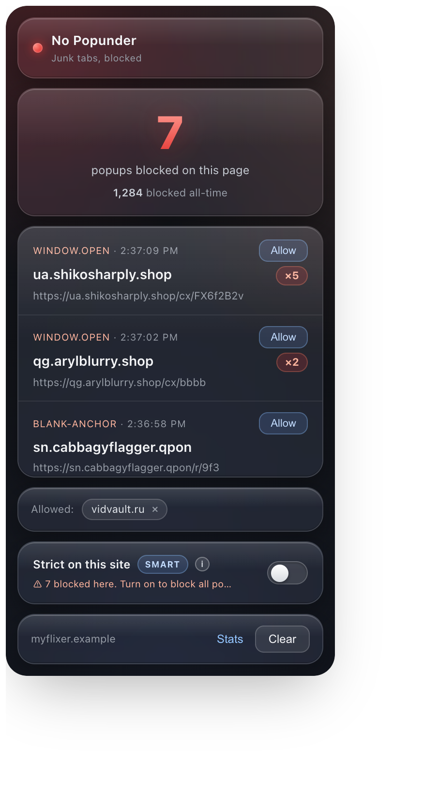

# No Popunder

[](LICENSE)
&nbsp;
&nbsp;
&nbsp;
&nbsp;

A site-agnostic Chrome extension that stops popunder ad tabs, the junk tabs that
open behind the page when you click. They are worst on free streaming sites. It
works on any site and tries hard not to break legit pop-ups like logins, payment
windows, and "open in new tab".

<p align="center">
  
</p>

## Why popunders get past Chrome

Chrome's built-in pop-up blocker only stops pop-ups that open *without* a user
gesture. Popunders get around that. They listen for any click and call
`window.open(adURL)` while riding on your real click, so to Chrome it looks like
you opened the tab yourself. That is why you need something aimed at the
technique rather than at a list of domains.

## How it works

`block.js` runs in every frame at `document_start` and intercepts the two ways
popunders open tabs: `window.open`, and an injected `<a target="_blank">` that
gets auto-clicked. It then decides each pop-up using two layers.

- **Smart (everywhere, default).** A cross-origin pop-up is blocked unless it
  directly followed you clicking a real link or button. A pop-up that fires from
  clicking the video, the page, or an invisible overlay (the popunder signature)
  is blocked. A login pop-up you opened from a real button is allowed. Pop-ups
  with no preceding click at all, like timers and page-load pop-ups, are blocked.
- **Strict (on `strictHosts`).** On sites that have no legit pop-ups, block every
  cross-origin pop-up whether or not there was a gesture. `7reels.cc` is seeded;
  add more in `block.js`. Strict also applies inside the page's player iframes,
  matched via `ancestorOrigins`.

Three things are always allowed in both layers: same-origin pop-ups, same-tab
navigations (`window.open(url, "_self")`), and any domain on your Allow list.

## Install (load unpacked)

1. Open `chrome://extensions` in Chrome.
2. Turn on Developer mode (top-right toggle).
3. Click Load unpacked and select this folder.
4. Browse normally. Popunders are gone and logins still work.

It talks to no servers. To remove it, click Remove on the extensions page.

> Works the same in any Chromium browser: Brave, Edge, Arc, Opera, Vivaldi.

> **Updating from an older version?** After you reload it on the extensions page,
> also refresh any open tabs. Chrome does not update content scripts in tabs that
> are already open.

## Privacy

No Popunder talks to no servers. No analytics, no tracking, no remote config, no
account. Nothing leaves your device. It asks for the minimum it needs:

- `storage`, to remember your Allow list, per-site Strict toggles, and counts.
- `activeTab`, to show the current tab's blocked count in the popup.
- host access (`<all_urls>`), because popunders can fire on any site, so the
  blocking script has to be allowed to run anywhere. It inspects `window.open`
  and link-click behavior in the page. It never reads or transmits page content.

The only thing it keeps is a local domain tally (ad host plus page host, never
full URLs) that you can view or wipe under Stats. Full policy in
[PRIVACY.md](PRIVACY.md).

## Seeing what it blocked

The toolbar icon shows a red badge with the number of pop-ups blocked on the
current page, which resets on navigation. Click the icon for the per-page count,
a lifetime total, and the blocked domains grouped so repeat offenders collapse
into one row (`host ×N`):

```
┌────────────────────────────────┐
│ ● No Popunder                  │
│               6                │
│   popups blocked on this page  │
│    1,284 blocked all-time      │
│ ────────────────────────────── │
│  WINDOW.OPEN · 2:37:06 [ Allow]│
│  qg.arylblurry.shop        ×3  │
│  https://qg.arylblurry.shop…   │
│  WINDOW.OPEN · 2:37:09 [ Allow]│
│  ua.shikosharply.shop      ×2  │
│  https://ua.shikosharply.sh…   │
│ ────────────────────────────── │
│  Allowed: ( vidvault.ru × )    │
│ ────────────────────────────── │
│  Strict on this site      (●─) │
│  blocking all pop-ups on …     │
│ ────────────────────────────── │
│  example.com          [ Clear ]│
└────────────────────────────────┘
```

The per-page count and its list reset on navigation. The lifetime total persists
across restarts, and Clear resets only the current page.

### Allow or re-block a domain

Click Allow next to a domain to stop blocking it everywhere. Its past entries are
removed and the badge drops, with no reload needed. Allowed domains show as chips
under Allowed. Click the × on a chip to re-block it.

### Make any site Strict (one click, no editing)

The Strict on this site switch marks the current site strict, so it blocks every
cross-origin pop-up here instead of just the popunder-signature ones. Flip it on
for a streaming site that still leaks and it takes effect right away, with no
reload and no editing of `block.js`. Flip it off to go back to Smart.

Built-in strict sites (shipped in `block.js`, for example `7reels.cc`) show the
switch on and disabled, since they are always strict. The toggle is stored
locally and synced into the blocker live.

## Learning from usage (all local, no analytics)

The extension keeps a small local aggregate so you can see what is actually
happening and improve the shipped defaults. It does this without sending anything
anywhere, and without Google Analytics, which cannot run under MV3 anyway and is
the wrong tool here.

It records domains only: the blocked ad host, and the host of the page it fired
on (for example `7reels.cc`), never the full URL, path, or query. Open it from
the popup footer under Stats:

- Sites with the most pop-ups, which are candidates to ship in `strictHosts`.
- Most-seen ad domains, which are candidates for a future blocklist.
- Export JSON and Reset stats.

The same local data powers a nudge. When a page keeps getting bombed and is not
strict yet, the Strict on this site toggle's subtitle changes to "⚠ N blocked
here. Turn on to block all pop-ups." so you can flip it on in one click.

> **Going crowd-sourced later (Phase 2).** To learn across users you would add an
> opt-in (default off) upload of just `{adHost, pageHost}` pairs to an endpoint
> you control, behind a clear privacy policy. Keep it host-only and anonymous.
> Do not ship that silently. For an ad blocker, quietly phoning home with
> browsing data is the fastest way to lose user trust and get delisted. The full
> plan (client, backend, privacy and legal, decisions, effort) is in
> [ROADMAP.md](ROADMAP.md).

## Tuning (in `block.js` → `CONFIG`)

- `strictHosts`, the sites to block all cross-origin pop-ups on. Add streaming
  sites here for zero leaks: `strictHosts: ['7reels.cc', 'anothersite.to']`.
- `gestureWindowMs`, how long after a real click a pop-up still counts as
  user-intended in Smart mode (default 1200ms).
- `blockWindowOpen` and `blockBlankAnchors`, to turn off a vector if you need to.
- `logBlocks`, `false` by default. The badge and popup already show every block,
  and console output can land on the `chrome://extensions` Errors page.

Reload the extension and refresh open tabs after editing.

## When it gets something wrong

If a legit pop-up gets blocked (rare, on a normal site), open the popup and click
Allow on that domain. It is remembered from then on.

If a popunder slips through on a normal site because it fired from a real button,
flip the Strict on this site switch in the popup to block everything cross-origin
there. To ship a site strict by default, add it to `strictHosts` in `block.js`.

## Files

- `manifest.json`, the extension definition (Manifest V3, `<all_urls>`, all
  frames).
- `block.js`, the Smart and Strict decision plus the blocking, in the MAIN world.
- `relay.js`, the isolated-world bridge. It forwards blocks to the worker and
  feeds the allowlist into `block.js` live.
- `background.js`, the per-tab tally, badge, blocked-URL list, lifetime total,
  and the local domain aggregate (`stats`).
- `popup.html` and `popup.js`, the toolbar panel (count, list, Allow, Strict
  toggle, nudge, Stats link).
- `options.html` and `options.js`, the local Stats page (export and reset).
- `icons/`, the toolbar icons.

## Verification

Tested live:

- Strict on `7reels.cc`: a cross-origin `window.open` with no gesture is blocked,
  and a same-host one passes.
- Smart on a normal page: a pop-up opened from a real button click passes, a
  pop-up fired from clicking a `<div>` is blocked, and a pop-up with no preceding
  click is blocked.
- The per-domain allowlist lets an allowed domain through while others stay
  blocked.

## Contributing

Contributions are welcome, especially sites that still leak popunders (add them
to `strictHosts`), legit pop-ups that got blocked, and popunders that slipped
through. The whole extension is about 50 KB of dependency-free vanilla JS with no
build step, so you can clone, load unpacked, edit, and reload. See
[CONTRIBUTING.md](CONTRIBUTING.md) for setup, how to test a change by hand, and
what to put in a report.

## Support

No Popunder is free and open source, and it stays that way. If it spared you a
few hundred junk tabs and you want to support the work, see
[`.github/FUNDING.yml`](.github/FUNDING.yml) for sponsor links. Starring the repo
helps too.

## License

[GPL-3.0](LICENSE) © No Popunder contributors.

Copyleft on purpose. A pop-up or ad blocker only earns trust if anyone can read
every line it runs and any fork stays just as open. GPLv3 guarantees that, and it
keeps the project compatible with community blocklists like EasyList and uBlock's
uAssets if they are ever incorporated.
